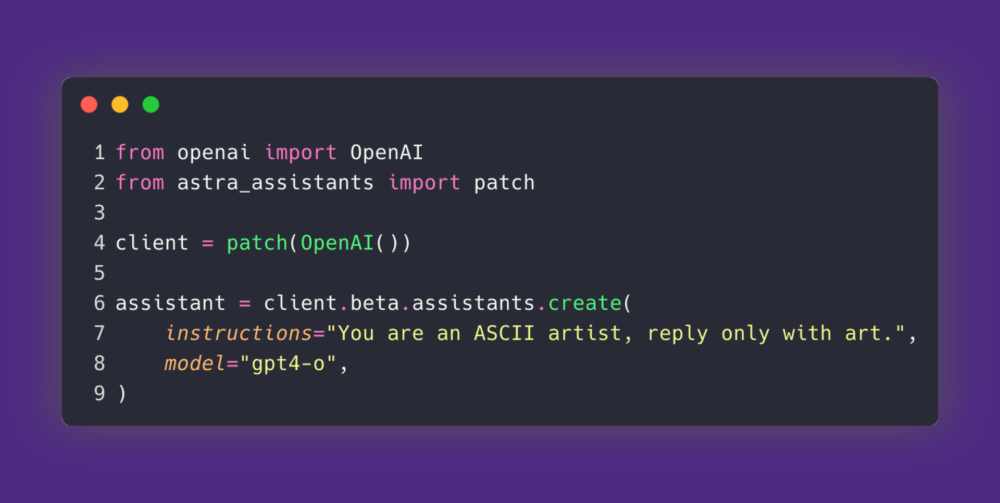

# Astra Assistant API Service
[](https://github.com/datastax/astra-assistants-api/commits/main)
[](https://github.com/datastax/astra-assistants-api/commits/main)
[](https://github.com/datastax/astra-assistants-api/actions/workflows/run-tests.yml)
[](https://github.com/datastax/astra-assistants-api/actions/workflows/docker.yml)
[](https://badge.fury.io/py/astra-assistants)
[](https://hub.docker.com/r/datastax/astra-assistants)
[](https://discord.gg/MEFVXUvsuy)
[](https://github.com/datastax/astra-assistants-api/stargazers)




A drop-in compatible service for the latest OpenAI Assistants API v2 (with streaming) with support for persistent threads, files, vector_stores, assistants, retreival, function calling and more using [AstraDB](https://astra.datastax.com) (DataStax's db as a service offering powered by [Apache Cassandra](https://cassandra.apache.org/_/index.html) and [jvector](https://github.com/jbellis/jvector)).

Supports dozens of third party LLM providers (or even local models) for both completion and embeddings (powered by [LiteLLM](https://github.com/BerriAI/litellm)). 

You can use our hosted Astra Assistants service, or host the open source API server yourself.

## Client Getting Started [](https://colab.research.google.com/gist/phact/a80dc113dd637ba4c4193415e69198c6/assistants_api_overview_python.ipynb)

To build an app that uses the Astra Asistants service install the [astra-assistants](https://pypi.org/project/astra-assistants/) python library with your favorite package manager. The code for astra-assistants can be found under (clients/)[./clients/]:

```
poetry add astra_assistants
```

[Signup for Astra and get an Admin API token](https://astra.datastax.com/signup):

Set your environment variables (depending on what LLMs you want to use), see the [.env.bkp](./.env.bkp) file for an example:

```
#!/bin/bash

# AstraDB -> https://astra.datastax.com/ --> tokens --> administrator user --> generate
export ASTRA_DB_APPLICATION_TOKEN=""

# OpenAI Models - https://platform.openai.com/api-keys --> create new secret key
export OPENAI_API_KEY=""

# Groq Models - https://console.groq.com/keys
export GROQ_API_KEY=""

# Anthropic claude models - https://console.anthropic.com/settings/keys
export ANTHROPIC_API_KEY=""

# Gemini models -> https://makersuite.google.com/app/apikey
export GEMINI_API_KEY=""

# Perplexity models -> https://www.perplexity.ai/settings/api  --> generate
export PERPLEXITYAI_API_KEY=""

# Cohere models -> https://dashboard.cohere.com/api-keys
export COHERE_API_KEY=""

# Bedrock models -> https://docs.aws.amazon.com/bedrock/latest/userguide/setting-up.html
export AWS_REGION_NAME=""
export AWS_ACCESS_KEY_ID=""
export AWS_SECRET_ACCESS_KEY=""

# vertexai models https://console.cloud.google.com/vertex-ai
export GOOGLE_JSON_PATH=""
export GOOGLE_PROJECT_ID=""

# ... for all models see the .env.bkp file
```

Then import and patch your client:

```python
from openai import OpenAI
from astra_assistants import patch
client = patch(OpenAI())
```
The system will create a db on your behalf and name it `assistant_api_db` using your token. Note, this means that the first request will hang until your db is ready (could be a couple of minutes). This will only happen once.

Now you're ready to create an assistant

```
assistant = client.beta.assistants.create(
  instructions="You are a personal math tutor. When asked a math question, write and run code to answer the question.",
  model="gpt-4-1106-preview",
  tools=[{"type": "retrieval"}]
)
```

By default, the service uses [AstraDB](https://astra.datastax.com/signup) as the database/vector store and OpenAI for embeddings and chat completion.


## Third party LLM Support

We now support [many third party models](https://docs.litellm.ai/docs/providers) for both embeddings and completion thanks to [litellm](https://github.com/BerriAI/litellm). Pass the api key of your service using `api-key` and `embedding-model` headers.

You can pass different models, just make sure you have the right corresponding api key in your environment.

```
model="gpt-4-1106-preview"
#model="gpt-3.5-turbo"
#model="cohere_chat/command-r"
#model="perplexity/mixtral-8x7b-instruct"
#model="perplexity/llama-3-sonar-large-32k-online"
#model="anthropic.claude-v2"
#model="gemini/gemini-1.5-pro-latest"
#model = "meta.llama2-13b-chat-v1"

assistant = client.beta.assistants.create(
    name="Math Tutor",
    instructions="You are a personal math tutor. Answer questions briefly, in a sentence or less.",
    model=model,
)
```

for third party embedding models we support `embedding_model` in `client.files.create`:
```
file = client.files.create(
    file=open(
        "./test/language_models_are_unsupervised_multitask_learners.pdf",
        "rb",
    ),
    purpose="assistants",
    embedding_model="text-embedding-3-large",
)
```

To run the examples using poetry create a .env file in this directory with your secrets and run:

    poetry install

Create your .env file and add your keys to it:

    cp .env.bkp .env

and 

    poetry run python examples/python/chat_completion/basic.py

    poetry run python examples/python/retrieval/basic.py

    poetry run python examples/python/streaming_retrieval/basic.py

    poetry run python examples/python/function_calling/basic.py


## Running yourself

### Docker

with docker, first pull the image from docker hub

    docker pull datastax/astra-assistants

or a specific version if you don't want latest:

    docker pull datastax/astra-assistants:v0.2.12

then run (-p to map your docker port 8080 to your host port 8080):

    docker run -p 8080:8080 datastax/astra-assistants


### Locally with poetry

or locally with poetry:

    poetry install

    poetry run python run.py

### Docker-compose with ollama

or with docker-compose for integration with ollama

    cd examples/ollama/gpu # or examples/ollama/cpu for cpu only for gpu you need docker-toolkit

    docker-compose up -d

you need to pull the model you want to ollama before using it

    curl http://localhost:11434/api/pull -d '{ "name": "deepseek-coder-v2" }'

your assistants client should route to the ollama container setting OLLAMA_API_BASE_URL. OLLAMA_API_BASE_URL should be set to http://ollama:11434 if you are using docker-compose. If you are using ollama on your localhost you can set it to http://localhost:11434


## Feedback / Help
For help or feedback file an [issue](https://github.com/datastax/astra-assistants-api/issues) or reach out to us on [Discord](https://discord.gg/j6vgnRke)

## Contributing

Check out our [contributing guide](./CONTRIBUTING.md)

## Coverage

See our coverage report [here](./coverage.md)

## Roadmap:
 - [X] Support for other embedding models and LLMs
 - [X] function calling
 - [X] Streaming support
 - [X] Assistants V2 with vector_store support
